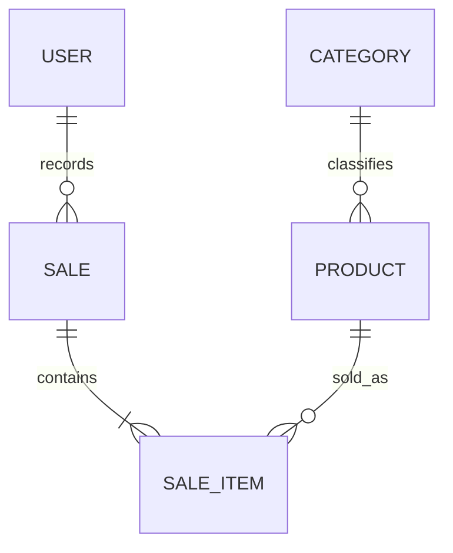

# Domain — Simple Stock Flow

> **Source:** [`spec/data-model.md`](../spec/data-model.md), especially §1–§8 and §11. Rules are distinguished according to whether they are enforced by the database engine, enforced only by the domain, or still pending.

## 1. Ubiquitous Language

| Term | Definition | Evidence |
|---|---|---|
| Product (`Product`) | Catalog item with a name, current price, stock, category, and optional image. | DP-03, §1, §2.2 |
| Category (`Category`) | Fixed product classification; it can be queried but has no editable lifecycle in the application. | D-10, §1, §2.1, §9.1 |
| Money (`Money`) | Monetary value in a single currency with two-decimal precision; product amounts must be positive. | D-05, D-07, §1, §2.2–§2.3 |
| Quantity (`Quantity`) | Whole units sold in a sale item; the quantity must be greater than zero. | §1, §2.4 |
| Sale (`Sale`) | A completed commercial event with a date, responsible operator, and sale items. A confirmed sale is immutable. | §1, §2.3, §7.1 |
| Sale item (`SaleItem`) | An internal part of a sale that retains the product, quantity, unit price, and historical names. It does not exist independently of its sale. | §1, §2.4 |
| Stock | Units available for a product; stock must never be negative. | §1, §2.2, ADR-002 |
| Frozen values | Copies of the product name, price, and category stored at the time of sale, independent of the current catalog. | D-06, §2.4, ADR-004 |
| User (`User`) | Authenticated internal operator with a normalized username, password hash, and role. It does not represent the end customer. | §1, §2.5, §7 |
| Role | One of the fixed values `admin` or `seller`. | §1, §2.5, §4 |
| Date range | Interval used to query sales or generate the report; the end cannot precede the start. | §1, Q7–Q9, §6.1 |
| Sales report | Aggregation queried from sales and sale items; it is calculated and not stored. | D-06, Q9, §6.1 |
| Image key | Opaque reference to a binary in external storage; it is neither a path nor the file content. | D-08, §1, §7.1 |

## 2. Entities and Relationships

- **`Product` — aggregate root.** Owns catalog data and behavior for changing permitted fields, withdrawing stock, restocking, attaching an image, and being soft-deleted. It identifies its category through `category_id` (§2.2, §5).
- **`Sale` — aggregate root.** Contains `SaleItem` objects. Only the sale itself can create its items; `Sale.AddItem` coordinates stock withdrawal and adding the item (§2.3–§2.4).
- **`User` — aggregate root.** Contains a normalized username, role, and password hash. A plaintext password must not enter the domain (D-09, §2.5, §7).
- **`Category` — reference entity.** Has an identity and unique name, but is not an aggregate root, has no editable lifecycle, and uses a read-only repository (§2.1, D-10).
- **Relationships:** A category classifies many products; a sale contains at least one item; each item points to a product; a sale is attributed to an operator. Aggregates refer to one another by identity, not by object reference (§5).

## 3. Domain Rules

| ID | Rule | Enforcement/evidence |
|---|---|---|
| RD-01 | A product name is required and is stored trimmed. | `Product.Rename`; `NOT NULL` in the engine, non-empty validation currently only in the domain (§2.2). |
| RD-02 | A product price must be strictly positive. | `Product.ChangePrice`; currently domain-only, with migration to the database planned in T-20 (§2.2, §4). |
| RD-03 | Stock must never become negative. | `Product.Withdraw` / `Restock` and PostgreSQL `CHECK stock >= 0` (§2.2, §4, ADR-002). |
| RD-04 | More units than are available cannot be withdrawn. | `Product.Withdraw`; domain process rule (§2.2). |
| RD-05 | Every product must belong to an existing category. | `Product.SetCategory` and FK-1 with `ON DELETE RESTRICT` (§2.2, §5). |
| RD-06 | A missing image is represented by `NULL`; the system stores an opaque key, not bytes or paths. | `Product.AttachImage`, D-08, §2.2, §7.1. |
| RD-07 | Products are soft-deleted; they are not physically deleted. | `deleted_at`, global filter, D-03, and ADR-003 (§2.2, §7.1). |
| RD-08 | A category name is required, non-empty, and trimmed. | `Category.Rename`; non-empty validation is currently domain-only (§2.1, §4). |
| RD-09 | Two categories cannot have the same name. | Unique index `IX_category_name` (§2.1, §4). |
| RD-10 | The category catalog is fixed and read-only in the application; five categories are seeded by the initial migration. | D-10, §2.1, §9.1. |
| RD-11 | A sale must identify the responsible operator with a required, non-empty value. | `Sale` constructor; `sold_by_user_id` and FK-4 are still marked as pending task T-12 in the model (§2.3, §3, §5). |
| RD-12 | A sale can be confirmed only if it contains at least one item. | `Sale.EnsureConfirmable`; domain-only rule (§2.3). |
| RD-13 | A product cannot appear more than once in the same sale. | `Sale.AddItem`; also supported by the unique index `(sale_id, product_id)` according to the status/task references in the model (§2.3, §4, §13). |
| RD-14 | Adding a sale item and withdrawing stock are treated as one domain operation. | `Sale.AddItem` calls `Product.Withdraw` before adding the item (§2.3). |
| RD-15 | A recorded sale cannot be edited or deleted. | No edit/delete ports exist; retention is indefinite (§2.3, §7.1). |
| RD-16 | Each sale item requires a strictly positive quantity. | `Quantity` constructor; currently domain-only (§2.4, §4). |
| RD-17 | Sale items freeze the product name, unit price, and category name at the time of sale. | `Sale.AddItem`, D-06, §2.4, ADR-004. These values are not updated when the catalog changes. |
| RD-18 | A user must have a required, unique, lowercase, trimmed username; the role must be `admin` or `seller`; the domain handles only password hashes. | `User.NormalizeUsername`, `Roles.IsValid`, hash port, D-09, §2.5, §4, §7. Username normalization and role validation are currently domain-only. |

**Implementation-status note:** A rule identifier does not mean the database already enforces the rule. The model marks some rules as “domain-only” and others as “pending (T-xx).” For example, `price > 0`, `quantity > 0`, role validity, and username normalization currently depend on the domain; T-20 plans to move invariants that the database can express into the engine (§4, T-20).

## 4. Events and Significant Operations

The model does not define a formal catalog of published domain events. Therefore, the following are **inferred significant operations**, not messaging contracts or persisted events:

- **Product created/updated:** creates or changes the name, price, stock, category, or image key within `Product` invariants (§2.2).
- **Stock withdrawn/restocked:** changes stock through domain behavior while preserving `stock >= 0` (§2.2, ADR-002).
- **Sale recorded:** builds a confirmable sale and its internal items; validates the batch of active products, withdraws stock, and freezes the sold values (§2.3–§2.4, Q3).
- **Product soft-deleted:** sets `deleted_at`, excluding the product from the active catalog without destroying its historical reference (D-03, ADR-003, §7.1).
- **Image replaced/deleted:** the key is unlinked before the system attempts to delete the external binary (D-08, §7.1).

A need for an audit table, event table, or `created_at` / `updated_at` columns cannot be inferred (§8).

## 5. Integrity, Persistence, and Concurrency

- There are five main tables: `category`, `product`, `sale`, `sale_item`, and `user`. `Money`, `Quantity`, and date range are value objects and do not have their own tables (§1–§3, D-07).
- PostgreSQL enforces primary keys, uniqueness of category name and username, FK-1, FK-2, and `CHECK stock >= 0`, as stated in §4 and §5. FK-3 and FK-4 are listed as pending tasks in the model and must not be treated as current guarantees without checking their status.
- Concurrent stock writes use optimistic concurrency control through `xmin`; the `CHECK` constraint prevents a write from leaving stock negative even if the domain flow fails (D-04, ADR-002).
- The sale and its stock changes must be saved atomically; **assumption SA-2**, because the transaction itself must be verified in the implementation (§2.3 and architecture).

## 6. Concepts Deliberately Outside the Domain

There is no customer entity, payment processing, multi-currency support, product description/SKU, sale editing/deletion, seller-level report breakdown, or generic change auditing (DP-02, DP-03, D-05, §7–§8). The report is an aggregated query, not an aggregate or persisted entity (D-06, Q9).
