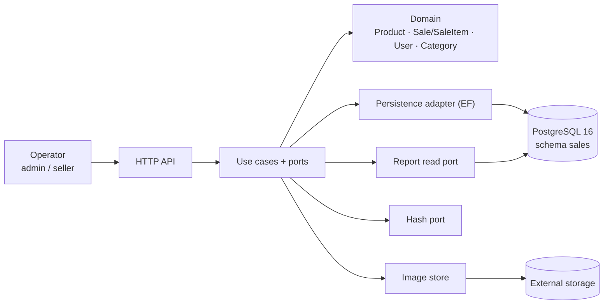

# Architecture — Simple Stock Flow

> **Source:** [`spec/data-model.md`](../spec/data-model.md). `§n` is a section of the data model; `FK-n`, `Q-n`, `T-xx`, `D-xx`, `ADR-00x` and `DP-0x` are identifiers the model mentions. Anything that does not come from the model is marked as an **assumption**.

## 1. Style

**Hexagonal architecture (ports and adapters) with an aggregate-based domain**, one API and one PostgreSQL 16 database (schema `sales`).

Evidence in the model: it mentions "the hexagon" (§2.5), "the persistence adapter" (§0), a read port for the report (§1, D-06) and a hash port (§2.5, D-09). Domain code and mapping code live in separate folders (§12).

**Assumption SA-1:** it is a single deployable service (monolith), not microservices.

## 2. Components

| Component | Responsibility | Source |
|---|---|---|
| Domain | Aggregates, value objects (`Money`, `Quantity`) and invariants | §2, D-07 |
| Application | Use cases, ports and the `Date range` value object | §1 |
| HTTP API | Exposes the use cases (`SaleView`) | §3, §12 |
| Persistence | Class-to-table mapping, soft-delete filter, `xmin` | §0, D-03, D-04 |
| Report read side | Aggregation computed in the engine, never persisted | D-06, Q9 |
| Hash / images | Produce the password hash; store the binary and return an opaque key | D-09, D-08 |

## 3. Aggregates

| Root | Inside | References others by |
|---|---|---|
| `Product` | `Money`, image (key) | `category_id` |
| `Sale` | `SaleItem` (only created by `Sale.AddItem`) | `product_id`; `sold_by_user_id` pending (T-12) |
| `User` | role, hash | — |
| `Category` | reference data, no lifecycle, not an aggregate root (§2.1) | — |

Aggregates reference each other by root identity, never by object (§5).

## 4. Where each rule lives

| Mark | Rules |
|---|---|
| **Engine** | 5 primary keys; unique `category.name` and `user.username`; FK-1 (product→category, RESTRICT); FK-2 (sale_item→sale, CASCADE); `CHECK stock >= 0` |
| **Domain only** (move to the engine in T-20) | `price > 0`, `quantity > 0`, non-empty category name, valid role, lowercase username |
| **Domain only** (cannot be expressed in the engine) | At least one line per sale; withdrawing more stock than available fails; deducting stock and adding the line is one operation; a sale is immutable |
| **Pending** | FK-4 and the rename `sold_by` → `sold_by_username` (T-12); access indexes (T-13) |

The model's criterion: whatever can be expressed in the engine must live in the engine (§"How to read this document", ADR-002). Later state declared in §13: `deleted_at` (T-09), `sale_id NOT NULL`, unique index `(sale_id, product_id)` and FK-3 (T-20).

## 5. Key flow: registering a sale

1. The products of the batch are read, **active ones only** (Q3, §5).
2. For each line, `Sale.AddItem` calls `Product.Withdraw` (fails if stock is insufficient) and copies name, price and category (**frozen values**, §2.3, §2.4).
3. `EnsureConfirmable`: at least one line (§2.3).
4. Sale and stock are saved with concurrency control through `xmin` (D-04). If two sales compete, one is rejected and the `CHECK` prevents negative stock (ADR-002).

**Assumptions:** SA-2 sale and stock are saved in a single transaction; SA-3 `sold_by` comes from the authenticated user; SA-4 an `xmin` conflict is rejected or retried.

## 6. Other decisions that shape the system

- **Persistence:** the schema is owned only by EF migrations (ADR-001); no `DEFAULT` values, UUIDs generated by the application, timestamps are `timestamptz`, money is `numeric(18,2)` and single-currency (§3, D-05).
- **Soft delete** of products through `deleted_at`; never a physical delete (§2.2, ADR-003).
- **Report:** groups by product, frozen name and frozen category, ordered by amount descending, with no breakdown by seller (§11.1, ADR-004, DP-02).
- **Security:** `password_hash` never appears in logs or responses and is never indexed (§7); only an administrator creates users, and the `admin` role is provisioned by the deployment (DP-04, §11); no credentials in the repository (§9.2).
- **Images:** only an opaque key is stored. When deleting, `image_key` is cleared first and the binary is removed afterwards (§7.1).

## 7. Observations about the data model

The model contradicts itself in a few places. They are declared here instead of being silently resolved (by article X the engine wins, and I have no access to it).

| # | Observation |
|---|---|
| O-1 | §3 and §12 say 22 columns; §10.1 returns 21 (the difference is `deleted_at`, T-09). |
| O-2 | The `product` table in §3 has a `category_name` row whose description belongs to `sale_item`; a product has only five attributes (DP-03). Treated as a misplaced row. |
| O-3 | The unique index `(sale_id, product_id)` appears as existing (§2.3, §4) and as missing (§6.2). The "today" figures are from Sep 19 while other sections already use Sep 20 (§13). |
| O-4 | `spec.md` CA-06.1 says "one row per product", but decision H-1 yields one row per product and frozen label; the model leaves this pending with the owner (§11.1). |

---

## 8. Closing check: the architecture against 01–04 and the model

Done after finishing `04-requirements`, `03-product`, `02-domain` and `01-context`.

| # | Check | Result |
|---|---|---|
| 1 | Does every user story (HU-01 to HU-11) have a component that serves it? | Yes: use cases and ports from §2; HU-06 also uses the image store. |
| 2 | Does every domain rule (RD-01 to RD-18) fall under "Where each rule lives"? | Yes: engine, domain only or pending (§4). |
| 3 | Is every non-functional requirement backed? | Yes: RNF-02 by `CHECK` and `xmin`; RNF-03 by the in-engine report and indexes; RNF-05 and RNF-06 by the hash port and privacy rules; RNF-08 by migrations. |
| 4 | Do the aggregates match the domain document? | Yes: `Product`, `Sale` with `SaleItem`, `User`; `Category` as reference data. |
| 5 | Is what the context document leaves out absent from the architecture? | Yes: no customers, payments, multi-currency, sale editing or audit columns. |
| 6 | Does every access pattern Q1–Q10 have a story? | Yes, except Q8 (no consumer; it should be removed from the port, §6.1). |

**Still to confirm outside the model:** role permissions (SR-1); rewriting CA-06.1 (O-4); and re-running the §10 queries against the engine to settle O-1 to O-3.

**Verdict:** the architecture is consistent with the domain, requirements, product and context documents. What remains open are internal contradictions of the data model, and they are declared.
