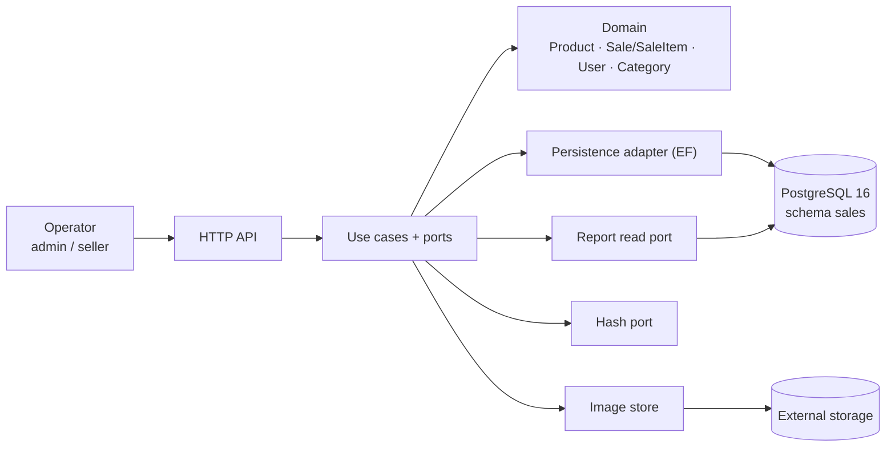

# Architecture — Simple Stock Flow

> **Source:** [`spec/data-model.md`](../spec/data-model.md). `§n` is a section of the data model; `FK-n`, `Q-n`, `T-xx`, `D-xx`, `ADR-00x` and `DP-0x` are identifiers the model mentions. Anything that does not come from the model is marked as an **assumption**.

## 1. Style

**Hexagonal architecture (ports and adapters) with an aggregate-based domain**, one API and one PostgreSQL 16 database (schema `sales`).

Evidence in the model: it mentions "the hexagon" (§2.5), "the persistence adapter" (§0), a read port for the report (§1, D-06) and a hash port (§2.5, D-09). Domain code and mapping code live in separate folders (§12).

**Assumption SA-1:** it is a single deployable service (monolith), not microservices.

## 2. Components

| Component | Responsibility | Source |
|---|---|---|
| Domain | Aggregates, value objects (`Money`, `Quantity`) and invariants | §2, D-07 |
| Application | Use cases, ports and the `Date range` value object | §1 |
| HTTP API | Exposes the use cases (`SaleView`) | §3, §12 |
| Persistence | Class-to-table mapping, soft-delete filter, `xmin` | §0, D-03, D-04 |
| Report read side | Aggregation computed in the engine, never persisted | D-06, Q9 |
| Hash / images | Produce the password hash; store the binary and return an opaque key | D-09, D-08 |

## 3. Aggregates

| Root | Inside | References others by |
|---|---|---|
| `Product` | `Money`, image (key) | `category_id` |
| `Sale` | `SaleItem` (only created by `Sale.AddItem`) | `product_id`; `sold_by_user_id` pending (T-12) |
| `User` | role, hash | — |
| `Category` | reference data, no lifecycle, not an aggregate root (§2.1) | — |

Aggregates reference each other by root identity, never by object (§5).

## 4. Where each rule lives

| Status | Rules and evidence |
|---|---|
| **Database-enforced — consistently reported in the model** | Five primary keys; unique `category.name` and `user.username`; FK-1 (`product` → `category`, `RESTRICT`); FK-2 (`sale_item` → `sale`, `CASCADE`); `CHECK stock >= 0` (§4–§5, §10). |
| **Database-enforced — latest status declared, but historical evidence is stale** | `product.deleted_at` and the soft-delete filter (D-1, §13); `sale_item.sale_id NOT NULL`, unique `(sale_id, product_id)`, and FK-3 (`sale_item.product_id` → `product.id`, `RESTRICT`) (D-2, §13). The older §10 output dated 2026-09-19 and §12 sign-off retain earlier statuses. Treat §13 as the latest model declaration, not as a fresh database verification by this review. |
| **Domain-only in the current rule classification** | `price > 0`, `quantity > 0`, non-empty category name, valid role, lowercase/trimmed username (§2, §4). Do not claim that every planned T-20 check was implemented unless the engine is re-queried. |
| **Domain process rules** | A sale requires at least one item; withdrawing more stock than available fails; withdrawing stock and adding a line are one domain operation; a recorded sale is immutable (§2.2–§2.4). |
| **Pending or disputed** | FK-4 and the `sold_by` → `sold_by_username` rename (T-12) remain pending. `sale_item.category_name` remains disputed: §2.4 calls it engine-enforced, but §3/§10.1 mark it pending/absent; T-11 is not listed as paid off in §13. Access indexes remain tied to T-13 (§6.2). |

The data model's rule is that invariants expressible in the database should live in the engine (its “How to read this document” section and ADR-002). The current source must still be read chronologically: §13 says D-1 and D-2 were paid off on 2026-09-20, but earlier sections and query outputs were not fully synchronized. This document does not claim a live database check was performed during this review.

## 5. Key flow: registering a sale

1. The products of the batch are read, **active ones only** (Q3, §5).
2. For each line, `Sale.AddItem` calls `Product.Withdraw` (fails if stock is insufficient) and freezes the product name and price (§2.3–§2.4). The category label is also intended to be frozen for reporting (D-06, ADR-004), but the physical status of `sale_item.category_name` is disputed between §2.4 and §3/§10.1; do not claim that column is deployed until verified.
3. `EnsureConfirmable`: at least one line (§2.3).
4. Sale and stock are saved with concurrency control through `xmin` (D-04). If two sales compete, one is rejected and the `CHECK` prevents negative stock (ADR-002).

**Assumptions:** SA-2 sale and stock are saved in a single transaction; SA-3 `sold_by` comes from the authenticated user; SA-4 an `xmin` conflict is rejected or retried.

## 6. Other decisions that shape the system

- **Persistence:** the schema is owned only by EF migrations (ADR-001); no `DEFAULT` values, UUIDs generated by the application, timestamps are `timestamptz`, money is `numeric(18,2)` and single-currency (§3, D-05).
- **Soft delete:** products are intended to be deactivated through `deleted_at`, never physically deleted. The latest model debt register says T-09 was completed (§13, D-1), while the older §10.1 snapshot omits the column; refresh the physical evidence.
- **Report:** groups by product, frozen name and frozen category, ordered by amount descending, with no breakdown by seller (§11.1, ADR-004, DP-02).
- **Security:** `password_hash` never appears in logs or responses and is never indexed (§7). The `admin` role is provisioned by deployment, not granted at runtime; an administrator creates seller accounts (DP-04, H-3 in §11/§13). The model reports defect A-1 as closed in §13; runtime behavior was not independently re-tested for this documentation review. No credentials belong in the repository (§9.2).
- **Images:** only an opaque key is stored. When deleting, `image_key` is cleared first and the binary is removed afterwards (§7.1).

## 7. Observations about the data model

The source contains contradictions and out-of-sync evidence. They are recorded here rather than silently reconciled. The later status in §13 is considered the latest **model declaration**, but no live database re-query was performed for this documentation review.

| # | Observation | Assessment treatment |
|---|---|---|
| O-1 | §3 and §12 describe 22 columns, while the historical §10.1 output dated 2026-09-19 returns 21 and omits `deleted_at`. D-1 in §13 says the column and global filter exist and T-09 was paid off on 2026-09-20. | Later status says `deleted_at` exists; the old query output and earlier prose should be refreshed. Do not treat the stale output as a current verification. |
| O-2 | The `product` table description in §3 contains a `category_name` row whose description belongs to `sale_item`; DP-03 limits the product to five attributes. | Treat the row in the `product` description as misplaced. The actual `sale_item.category_name` implementation remains separately disputed because §2.4 and §3/§10.1 disagree. |
| O-3 | §2.3/§4 describe `(sale_id, product_id)` and FK-3 as present; §6.2/§10.3 and §12 preserve missing/pending statuses. D-2 in §13 says the `sale_id NOT NULL`, composite unique index, and FK-3 work was paid off on 2026-09-20. | Use the latest §13 status as the model's declared status, but flag the dated query output and sign-off for refresh against the engine. FK-4 is still pending T-12. |
| O-4 | H-1 in §11.1 closes the report decision: group by the frozen category label. The signed criterion CA-06.1 still says “one row per product.” | The product behavior decision is closed; rewriting the acceptance-criterion wording remains an open documentation task. |

**Derived verification target (not a fresh observation):** if the latest §13 D-1/D-2 statuses are reflected in the engine, the pre-debt §10 snapshot would be expected to move from 21 to **22 declared columns**, from 8 to **9 constraints** (FK-3 added), and from 12 to **13 indexes** (the composite unique index added). These counts must be confirmed by re-running the queries; they must not be presented as measured results from this review.

---

## 8. Closing check: architecture against 00–04 and the data model

This check reviews document coverage and cross-document consistency. It is not a substitute for executing the SQL checks in the model against the live engine.

| # | Check | Result |
|---|---|---|
| 1 | Does every user story (US-01 to US-11) have an architectural component or flow? | Yes: use cases and ports cover the stories; US-06 also uses the image store. Role authorization remains partly unspecified for catalog and report access (SR-1). |
| 2 | Does every domain rule (DR-01 to DR-18) have a declared enforcement location? | Yes: the domain document identifies engine, domain-only, and disputed/pending cases. Physical statuses for D-1/D-2 reflect the latest §13 declaration but still need refreshed engine evidence. |
| 3 | Is every non-functional requirement addressed? | **NFR-01:** `Money`, `numeric(18,2)`, and single-currency rule (D-05). **NFR-02:** `CHECK stock >= 0`, optimistic concurrency via `xmin` (D-04, ADR-002). **NFR-03:** Q1/Q7/Q9 and access-index design; Q8 has no consumer and should be removed or justified. **NFR-04:** `timestamptz`, UTC, and valid date-range value object (§1, §3). **NFR-05:** hash port, no hash in logs/responses, no index (§7, D-09). **NFR-06:** attribute-level privacy and explicitly configured API authorization (§7; SR-1 remains partly open). **NFR-07:** opaque image key, external binary store, unlink-before-delete order (D-08, §7.1); orphan cleanup H-2 remains open. **NFR-08:** schema changes owned by EF migrations (ADR-001, §3.2). |
| 4 | Do the aggregates match the domain document? | Yes: `Product`, `Sale` with internal `SaleItem`, and `User`; `Category` is reference data rather than an aggregate root. |
| 5 | Is functionality explicitly outside the context document also absent from the architecture? | Yes: no customer entity, payments, multi-currency, sale editing/deletion, seller-level report breakdown, or generic audit columns. |
| 6 | Is every access pattern Q1–Q10 reflected in a story or explicitly handled? | Q1–Q7 and Q9–Q10 are represented by catalog, sales, report, and authentication needs. **Q8 is the declared exception:** the model says it has no consumer; remove it from the port or document an actual consumer rather than inventing a story. |

**Remaining follow-up items:** (1) refresh the relevant §10 query evidence against PostgreSQL and reconcile O-1–O-3; (2) verify the physical status of `sale_item.category_name` / T-11; (3) keep FK-4 and the `sold_by` rename marked pending T-12; (4) update CA-06.1 wording to match closed decision H-1; (5) confirm catalog/report authorization details under SR-1; and (6) resolve image-orphan cleanup policy H-2 outside the schema.

**Verdict:** the reconstructed documents largely agree on the intended system boundaries, domain model, requirements, and architecture. The remaining limitations are explicit source-status/documentation gaps, not silently invented behavior. A final claim of implementation consistency requires a fresh database verification.
