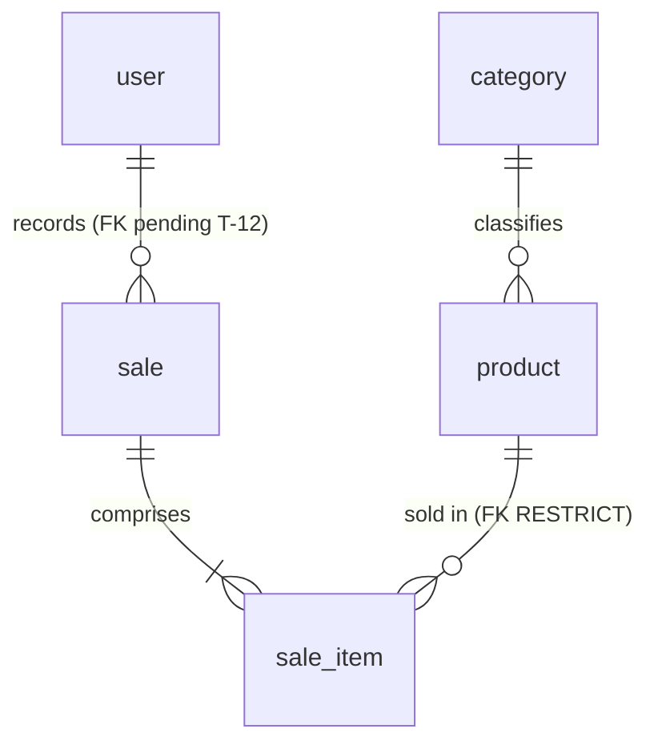

# Data Model — Simple Stock Flow


**The single source of truth for the data model.** Implementers should not need to inspect the code or connect to the database engine to know what exists, what type it has, which rule applies, and **where that rule currently lives**.

- **Date:** 2026-09-19
- **Verified against:** PostgreSQL 16.14 (`simple-stock-flow-db-1`), database `simple_stock_flow`, schema `sales`, server in UTC. The queries and their literal output appear in [§10](#10-how-to-verify-that-this-document-is-accurate).
- **Governed by:** [`constitution.md`](constitution.md) (non-negotiable) and [`spec.md`](spec.md) (what and why). Technical decisions D-01…D-10 are in [`plan.md`](plan.md) §1; the system structure is in [`architecture.md`](architecture.md); the four structural decisions are in [`adr/`](adr/).
- **`plan.md` no longer describes the schema.** Its §§2 and 3 link here. If anything there conflicts with this document, this document takes precedence; if this document conflicts with the database engine, **the engine takes precedence** (Article X), and this document is wrong.

---

## How to read this document

Every model rule has a status marker, and **there are only three**:

| Marker | Meaning |
|---|---|
| **engine** | It exists in PostgreSQL right now. A manual `INSERT` either obeys it or fails |
| **domain only** | It is enforced by C# and nothing else. **An `INSERT` through `psql` bypasses it silently** |
| **pending (T-xx)** | It does not exist yet. The corresponding task in [`tasks.md`](tasks.md) will add it |

**Why the third column is the heart of this document.** An invariant that lives only in C# protects the application, not the data: any `psql` session, migration, or future service can bypass it without noticing. [ADR-002](adr/adr-002-concurrencia-optimista.md) established the criterion for `stock >= 0` — *if the constraint fires, something wrote outside the adapter* — and that criterion applies to **all invariants that can be expressed in the engine**. Anything not enforced is declared pending; it is not promised.

---

## 0. Schema naming convention

**All five tables use singular names.** The governance convention table requires this, and the project follows it:

| Element | Convention | Example |
|---|---|---|
| Entity | `PascalCase`, English, **singular**, ASCII | `SaleItem` |
| Attribute | `snake_case`, English, **singular**, ASCII | `unit_price` |
| Collection attribute | **Never plural** | `sale_item`, not `sale_items` |

The mapping to the schema is direct: `category`, `product`, `sale`, `sale_item`, `user`. **The table name becomes singular; the schema remains `sales`**, so the fully qualified sales aggregate is `sales.sale`.

**The singular convention does not extend to object code; that is a boundary, not an exception.** The domain class names (`Product`, `Sale`, `SaleItem`, `User`, `Category`) were already correctly singular. C# collections (`Sale.Items`, `DbSet<Product> Products`) **remain plural** because they name sets of objects, not tables. Translating between the two naming styles is the persistence adapter's responsibility, exactly where mapping belongs.

**`user` does not require quotation marks, and this has been verified.** PostgreSQL treats `user` as a keyword **only when unqualified**; when the name includes a schema, it reads it as an identifier:

```sql
create table sales."user"(id int);
select * from sales.user;   -- works WITHOUT quotes
```

All queries in this project are prefixed with `sales.`, so the issue does not arise — and EF quotes the identifier on its own anyway. **The reason is schema qualification, not pluralization**: any document giving the other reason is wrong, even if it reaches the right conclusion.

**Writing an identifier and seeing how it is displayed are not the same thing.** PostgreSQL **does not require** quotation marks when writing the query, but it **does display them** when rendering the identifier itself: in §§10.2 and 10.3 the table appears as `sales."user"`, not `sales.user`. That is catalog formatting, not a syntax requirement, and no query in this project needs to quote it.

> The other axis of the convention — which names EF generates and which are written manually — is covered in [§3.1](#31-naming-conventions-two-styles-currently-coexist).

---

## 1. Domain glossary

Business language is used here. Code and column names are in English (Article XI); the technical column indicates where each term lives.

| Business term | Functional definition | Technical location |
|---|---|---|
| **Product** | Catalog item. It has **a name, price, stock, category, and optional image, and nothing else** (DP-03) | `Product` · table `product` |
| **Category** | Classification to which a product belongs. A **fixed set of five** seeded categories, with no maintenance operations (D-10) | `Category` · table `category` |
| **Price** | The current monetary value of a product in the catalog. Strictly positive | `Money` value object · `product.price` column |
| **Stock** | Available units of a product. Never negative | `product.stock` |
| **Product image** | **Opaque key** for a binary object in external storage. It is neither the binary itself nor a path (D-08). Absence is represented by `NULL`, never by an empty string | `product.image_key` |
| **Sale** | A completed and **immutable** commercial event: who, when, and what. Once recorded, it cannot be edited or deleted | `Sale` · table `sale` |
| **Sale item** | A line in a sale: product, quantity, and the **price frozen at the time of sale**. It does not exist outside its sale | `SaleItem` · table `sale_item` |
| **Quantity** | Units sold on one line. Strictly positive | `Quantity` value object · `sale_item.quantity` |
| **Sale total** | Sum of line subtotals. **Calculated, not stored** (Article VII) | `Sale.Total` · **no column** |
| **Line subtotal** | Unit price multiplied by quantity. **Calculated, not stored** | `SaleItem.Subtotal` · **no column** |
| **User** | Internal operator who authenticates and records sales. **There is no customer or buyer entity** | `User` · table `user` |
| **Role** | A user's assignment from a closed set of two values: `admin` or `seller` | `user.role` |
| **Password hash** | An irreversible fingerprint of the password. The domain **never sees the plain-text password** (D-09) | `user.password_hash` |
| **Date range** | Time window for the report. The end cannot precede the start | Application-layer value object · **no table** |
| **Sales report** | Aggregation by product over a date range. **Not persisted**: computed by the engine through a read port (D-06) | Read model · **no table** |

**Frozen value.** When this document says a value is *frozen*, the sale line stores a **copy of that value at the time of sale**, and that copy does not track the catalog. This is not denormalization: the sale price and sold product name are **facts belonging to the sale**, not product attributes fetched later. This allows a product to be renamed or repriced without rewriting reports for closed periods.

**Adapted from the recovered document, with two corrections.** The glossary in the recovered `data/data-model.md` §2 included *sale currency* as a term; **the system is single-currency by construction** (D-05), and no table has a currency column. Its Product definition also left room for additional attributes; **DP-03 closes that door**: name, price, stock, category, and image. No description, SKU, or reference code.

---
## 2. The five entities and their invariants

**Five entities, five tables, no extras.** There is no report table, audit table, counter table, or table for value objects — value objects have no identity and live within the row of their owner (D-07).



### 2.1 `Category` — reference entity

| Invariant | Enforcement | Status |
|---|---|---|
| Name is required and non-empty; stored trimmed | `Category.Rename` | **domain only** · moved to the engine in T-20 |
| Name is unique | Unique index `IX_category_name` | **engine** |

**It is not an aggregate root and has no lifecycle.** Its repository is **read-only**: no port creates, renames, or deletes categories. The five rows are created in the initial migration (see [§9](#9-seeding-strategy)).

### 2.2 `Product` — aggregate root (catalog)

| Invariant | Enforcement | Status |
|---|---|---|
| Name is required and non-empty; stored trimmed | `Product.Rename` | **domain only** (`NOT NULL` is enforced by the engine; *non-empty* is not) |
| `price > 0` | `Product.ChangePrice` | **domain only** · T-20 |
| `stock >= 0` after any operation | `Product.Withdraw` / `Product.Restock` | **engine** — `ck_product_stock_non_negative`, the final safeguard from ADR-002 |
| Withdrawing more stock than is available fails | `Product.Withdraw` | **domain only** — a process rule that cannot be expressed as a `CHECK` |
| Category is required and must exist | `Product.SetCategory` + `FK_product_category_category_id` | **engine** |
| Missing `image_key` ⇒ `NULL`, never an empty string | `Product.AttachImage` normalizes blank values to `null` | **domain only** · no equivalent engine rule is pending: `NULL` is the only representation needed, and `image_key IS NULL` is sufficient |
| Never physically deleted: soft delete | Shadow property `deleted_at` + global filter | **engine** since T-09 · the column exists and the global filter applies it — see [ADR-003](adr/adr-003-baja-logica.md) |

**`Money` permits a zero amount, and that matters.** Its constructor rejects only negative values, so `new Money(0)` is valid. The only guard for `price > 0` is `Product.ChangePrice`: a product with price 0 inserted through `psql` currently passes. T-20's `CHECK` closes exactly this gap.

**The rounding rule lives in `Money`, not in the column.** `Money` rounds to **2 decimal places using `MidpointRounding.AwayFromZero`** before saving; the column is `numeric(18,2)`. They match by construction, not by chance. **If either changes, the other must change in the same migration**: with more decimal places in the column, the extra precision would always be zero; with more decimal places in `Money`, the engine would truncate the value independently and the amount read back would differ from the amount written.

### 2.3 `Sale` — aggregate root (sales)

| Invariant | Enforcement | Status |
|---|---|---|
| Records who made the sale; required and non-empty | `Sale` constructor | **domain only** (`NOT NULL` is enforced by the engine) |
| **At least one line** is required to confirm a sale | `Sale.EnsureConfirmable` | **domain only** — cannot be expressed in a `CHECK`; it would require a deferred trigger |
| **A product cannot appear more than once** in the same sale | `Sale.AddItem` rejects duplicates | **domain only** and now also **engine**: the unique index `(sale_id, product_id)` exists from T-20, with `INCLUDE (quantity, unit_price)` |
| Deducting stock and adding a line are **one operation** | `Sale.AddItem` calls `Product.Withdraw` before adding the line | **domain only** — this rule gives the aggregate its meaning |
| Immutable once recorded | No edit or delete port exists | **domain only** (enforced by the absence of an operation) |

**The sale does not know about currency.** The total is calculated by summing subtotals, and `Money` requires matching currencies when adding. Because the mapping always reconstructs the default currency, this cannot currently fail. **An explicit guard in `Sale.AddItem` is a small, low-cost piece of debt with a task assigned: T-05.**

### 2.4 `SaleItem` — entity internal to the `Sale` aggregate

| Invariant | Enforcement | Status |
|---|---|---|
| Product is required | `SaleItem` constructor + `NOT NULL` | **engine** · `NOT NULL` and FK `FK_sale_item_product_product_id` with `RESTRICT`, added by T-20 |
| `quantity > 0` | `Quantity` constructor | **domain only** · T-20 |
| Name and price are **frozen** at the time of sale | `Sale.AddItem` copies them from `Product` | **domain only**, by construction |
| **Frozen category name** | `SaleItem` constructor + `NOT NULL` | **engine** (T-11) · `sale_item.category_name`, intentionally without a foreign key — D-06 and [ADR-004](adr/adr-004-reporte-agregado-y-congelado.md) |
| **Cannot exist outside its sale** | `FK_sale_item_sale_sale_id ON DELETE CASCADE` | Entirely **engine**: the cascade and the `sale_id NOT NULL` that completes it were added by T-20 |

**It cannot be constructed from outside.** Its constructor is `internal`, and only `Sale.AddItem` invokes it: there is no legitimate way to create a standalone line.

### 2.5 `User` — aggregate root (identity)

| Invariant | Enforcement | Status |
|---|---|---|
| Username is required and **unique** | Constructor + unique index `IX_user_username` | **engine** (uniqueness) |
| Username is **lowercase and trimmed** | `User.NormalizeUsername` | **domain only** · T-20 |
| Password hash is required and non-empty | `User` constructor | **domain only** (`NOT NULL` is enforced by the engine) |
| `role` is in `('admin','seller')` | `Roles.IsValid` | **domain only** · T-20 |
| The domain **never sees the plain-text password** | Hash produced through a port (D-09) | By design of the hexagonal architecture |

**Why normalization is an invariant, not a convenience.** A lookup that bypasses `NormalizeUsername` could allow `Ana ` (with a trailing space) to be registered as a new account that **could never log in**: the aggregate would store it as `ana` and collide with the existing account.

---
## 3. Physical model — 22 columns

Schema `sales` in database `simple_stock_flow`. **No column has a `DEFAULT`, deliberately: the domain supplies values**, never the engine — an engine default would create a second source of truth that nobody tests. The types are those currently returned by `information_schema.columns`; the literal output appears in [§10](#10-how-to-verify-that-this-document-is-accurate).

**All tables are singular, without exception**, under the convention in [§0](#0-schema-naming-convention). The rationale and verification for `user` are explained there and are not repeated here.

**`category`** — read-only seed data (D-10).

| Column | Type | Nullable | Default | Note |
|---|---|---|---|---|
| `id` | `uuid` | no | none | Primary key. Literal identifiers in the migration allow tests to reference them (see [§9](#9-seeding-strategy)) |
| `name` | `varchar(120)` | no | none | Unique |

**`product`**

| Column | Type | Nullable | Default | Note |
|---|---|---|---|---|
| `id` | `uuid` | no | none | Primary key |
| `name` | `varchar(200)` | no | none | Domain trims it before saving |
| `price` | `numeric(18,2)` | no | none | Amount only: **no currency column** (D-05). 16 integer digits, more than sufficient for the scope |
| `stock` | `integer` | no | none | |
| `category_id` | `uuid` | no | none | Restrictive foreign key to `category` — [§5](#5-foreign-key-policy), FK-1 |
| `image_key` | `varchar(512)` | yes | none | Opaque key, never a path or bytes (D-08) |
| `category_name` | `varchar(120)` | no | none | **engine** (T-11) · label frozen at the time of sale. Intentionally has no foreign key: if it did, renaming a category would rewrite history, exactly what ADR-004 forbids. Same length as `category.name`; **both must change together** |
| `deleted_at` | `timestamptz` | yes | none | **engine** (T-09, verified against `information_schema`: nullable, no default) · shadow property, not a property of the aggregate (D-03). `NULL` while the product is active, making it suitable for partial-index predicates |
| `xmin` | `xid` | — | — | **Engine system column**, not part of the schema definition. PostgreSQL increments it on every `UPDATE`. It is the concurrency token for D-04, exposed as a shadow property (T-10). **It does not appear in `information_schema` because it is not a declared column**, so it is not counted among the 21 |

**`sale`** — the `sales` schema groups the whole system; the `sale` table names the aggregate. **The singular name removes the former collision**: before renaming, a table named `sales` existed inside schema `sales`, so it was qualified as `sales.sales`. It is now `sales.sale`, and the prefix does not change: **the table becomes singular, never the schema**.

| Column | Type | Nullable | Default | Note |
|---|---|---|---|---|
| `id` | `uuid` | no | none | Primary key |
| `sold_at` | `timestamptz` | no | none | Time of sale. **The only business timestamp in the system** (see [§8](#8-audit-created_at--updated_at)) |
| `sold_by` | `varchar(120)` | no | none | **Current name.** Renamed to `sold_by_username` in **T-12** (see note below) |
| `sold_by_user_id` | `uuid` | no | none | **pending (T-12)** · restrictive foreign key to `user.id` — FK-4 |

**`sale_item`**

| Column | Type | Nullable | Default | Note |
|---|---|---|---|---|
| `id` | `uuid` | no | none | Primary key |
| `product_id` | `uuid` | no | none | **No foreign key today** — FK-3, [§5](#5-foreign-key-policy) |
| `product_name` | `varchar(200)` | no | none | Frozen copy of `product.name`, **intentionally the same length** |
| `quantity` | `integer` | no | none | |
| `unit_price` | `numeric(18,2)` | no | none | Frozen copy of the price. **One column only**: no `unit_price_currency` (D-05) |
| `sale_id` | `uuid` | **yes — a defect** | none | Must become `NOT NULL`: a line without a sale has no meaning, contradicts the existing cascade, and makes the composite unique index ineffective. Cause: `HasForeignKey("sale_id")` creates a shadow property, and EF makes it nullable when the relationship does not declare `IsRequired()` |
| `category_name` | `varchar(120)` | no | none | **pending (T-11)** · same length as `category.name` because it is a frozen copy (D-06). `NOT NULL` is **free today because the table is empty**; after the first sale, a backfill will be required during migration |

**`user`**

| Column | Type | Nullable | Default | Note |
|---|---|---|---|---|
| `id` | `uuid` | no | none | Primary key |
| `username` | `varchar(120)` | no | none | Unique. Stored lowercase and trimmed |
| `password_hash` | `varchar(512)` | no | none | **Never indexed** (see [§7](#7-privacy-and-retention)) |
| `role` | `varchar(40)` | no | none | Closed set: `admin`, `seller` |

**Two cross-cutting rules, stated explicitly so nobody has to infer them.**

1. **No currency column exists in any table: the system is single-currency** (D-05). Do not reintroduce one.
2. **All timestamps use `timestamptz`, without exception.** The server runs in UTC. Anyone adding a new date/time column should not have to infer this from `sold_at`.

**About the two `sold_by` names.** The database column is currently called `sold_by`, and the domain property is `Sale.SoldBy`. **The code should be aligned to the longer name, not the other way around**, because once T-12 adds `sold_by_user_id` alongside it, `sold_by` alone will not distinguish them. The rename **does not change the API contract** — the field sent is `SaleView.SoldBy` and remains unchanged — and it is inexpensive now because the table is empty.

### 3.1 Naming conventions — two styles currently coexist

Names generated by EF keep its style: `PK_`, `IX_`, `FK_`, in `PascalCase` and quoted. Names written manually — currently **only `CHECK` constraints** — use `snake_case` and the `ck_{table}_{rule}` pattern, such as the existing `ck_product_stock_non_negative`. **Both conventions are intentional:** renaming EF-generated objects would require maintaining a parallel list of names for every migration.

**Derived names follow the table name.** When tables became singular (see [§0](#0-schema-naming-convention)), EF regenerated its names — `PK_product`, `IX_category_name`, `FK_sale_item_sale_sale_id` — without anyone writing them manually. **The only name that must be renamed manually is the `CHECK`**, precisely because EF does not generate it: `ck_products_stock_non_negative` became `ck_product_stock_non_negative`. Leaving the old name would have made it the only schema object still using a plural table name.

### 3.2 Applied migrations

Four migrations, not one. The schema is owned exclusively by EF migrations ([ADR-001](adr/adr-001-propiedad-del-esquema.md)).

| Migration | What it does | Task |
|---|---|---|
| `20260919175513_InitialSchema` | Creates the five tables, two foreign keys, unique and access indexes, and **the five seed categories** | T-02 |
| `20260919194003_StockNonNegative` | Adds the schema's only `CHECK` | T-10 |
| `20260919203018_AccentSeedCategoryNames` | Fixes the accent in one seeded category: *Fontaneria* → *Fontanería* | T-02 |
| `20260919215344_RenameTablesToSingular` | Changes all five table names to singular (see [§0](#0-schema-naming-convention)). EF-derived names — primary keys, indexes, and foreign keys — are updated as well, together with the one manually named `CHECK`: `ck_products_stock_non_negative` → `ck_product_stock_non_negative`. **No columns are renamed** | T-02 |

**The rename is a migration, not a documentation edit.** It follows the same route as all DDL in the system — ADR-001 permits no other route — and was applied while `product`, `sale`, and `sale_item` were **empty**, while `category` had 5 rows and `user` had 1: an instantaneous `ALTER TABLE ... RENAME TO`. It would still be possible after the first real sale, but no longer cost-free.

The migration history lives in `public."__EFMigrationsHistory"` — **outside schema `sales`**, which is why the column query returns 21 rather than more rows.

---

## 4. Constraints and indexes: where each rule lives

**The schema currently has eight constraints: five primary keys, two foreign keys, and one `CHECK`.** The two uniqueness rules (`category.name`, `user.username`) are enforced by the engine through **unique indexes**, not constraints, so they do not appear in `pg_constraint` but **are enforced**. Everything else belongs to the domain or is pending.

| Rule | Engine object | Where it lives today |
|---|---|---|
| Primary keys for all 5 tables | `PK_category`, `PK_product`, `PK_sale`, `PK_sale_item`, `PK_user` | **engine** |
| `category.name` unique | `IX_category_name` (unique index) | **engine** |
| `user.username` unique | `IX_user_username` (unique index) | **engine** |
| `product.category_id` → `category.id`, `ON DELETE RESTRICT` | `FK_product_category_category_id` | **engine** |
| `sale_item.sale_id` → `sale.id`, `ON DELETE CASCADE` | `FK_sale_item_sale_sale_id` | **engine** |
| `product.stock >= 0` | `ck_product_stock_non_negative` | **engine** — ADR-002's last line of defense |
| `product.price > 0` | — | **domain only** · `Product.ChangePrice`. Moving it to the engine is T-20. See `Money` in [§2.2](#22-product--aggregate-root-catalog) |
| `sale_item.quantity > 0` | — | **domain only** · `Quantity` constructor. Moving it to the engine is T-20 |
| `category.name` non-empty | — | **domain only** · `Category.Rename`. Moving it to the engine is T-20 |
| `user.role` in `('admin','seller')` | — | **domain only** · `Roles.IsValid`. Moving it to the engine is T-20 |
| `user.username` lowercase | — | **domain only** · `User.NormalizeUsername`. Moving it to the engine is T-20 |
| `sale_item.sale_id NOT NULL` | `sale_item.sale_id` | **engine** (T-20) · prerequisite for the composite unique index, and therefore added first |
| Unique `(sale_id, product_id)` | `IX_sale_item_sale_id_product_id` | **engine** (T-20) · **cannot do its job while `sale_id` allows NULLs**: in a unique index, every `NULL` is distinct, so two lines with null `sale_id` and the same product can coexist without an error |
| `sale_item.product_id` → `product.id`, `ON DELETE RESTRICT` | `FK_sale_item_product_product_id` | **engine** (T-20) · **not a new decision: ADR-003 already relies on it** as a last-resort safeguard so a manual delete fails loudly. It was never implemented, and today `sale_item` has **no foreign key to the catalog** |
| `sale.sold_by_user_id` → `user.id`, `ON DELETE RESTRICT` | — | **pending (T-12)** · sale authorship must not become orphaned |
| Access indexes (`product`, `sale`, `sale_item`) | See [§6.2](#62-indexes-existing-and-missing) | Three exist, three are missing — **§6.2 distinguishes them individually** |

**Moving the five invariants marked *domain only* into the engine is the concrete debt identified by this document, with task T-20.** It changes no domain code: it adds five `CHECK` constraints and one index. The change means the invariants no longer depend on every caller going through the adapter.

### 4.1 Accents and capitalization in `category.name`: uniqueness remains sensitive to both

*Fontanería* and *Fontaneria* are both valid rows, as are *Pinturas* and *pinturas*. **This is explicitly accepted, not an oversight:** the five categories are read-only seed data, there is no category CRUD, and no port creates categories, so **the interface cannot cause a collision**. The alternative — `citext` or a unique index on `unaccent(lower(name))` — would add a deployment extension to protect a table nobody writes to.

**Explicit review condition: if category maintenance is ever opened up, this decision must be revisited before that CRUD is written.**

---
## 5. Foreign-key policy

**Four relationships imply four foreign keys. Two exist today.** This table states the full policy: each foreign key's `ON DELETE` and `ON UPDATE` behavior, and **the reason for that behavior**.

| # | Foreign key | Reference | `ON DELETE` | `ON UPDATE` | Status | Why this action |
|---|---|---|---|---|---|---|
| **FK-1** | `product.category_id` | `category.id` | **`RESTRICT`** | `NO ACTION` | **engine** | A category with products cannot be deleted. This is theoretical today — there is no category-delete port — but **the constraint must exist before such a port exists**, not after |
| **FK-2** | `sale_item.sale_id` | `sale.id` | **`CASCADE`** | `NO ACTION` | **engine** | Pure composition: a line has no life outside its sale. **In practice, it never fires**, because sales are not deleted (see [§7.1](#71-retention)). It exists so the model accurately states the relationship, not so it can be used |
| **FK-3** | `sale_item.product_id` | `product.id` | **`RESTRICT`** | `NO ACTION` | **engine** (T-20) | **Last-resort safeguard.** A physical delete must never orphan a sale line or break the report. With the soft-delete policy in ADR-003, it should never fire; it exists so a manual `DELETE` or future code change **fails loudly** instead of corrupting history |
| **FK-4** | `sale.sold_by_user_id` | `user.id` | **`RESTRICT`** | `NO ACTION` | **pending (T-12)** | Sale authorship is an accounting fact. A user with sales cannot be deleted |

**`ON UPDATE NO ACTION` for all four is a decision, not an omission.** All primary keys are UUIDs generated by the application and **never change**. There is no scenario in which a key is updated, so `CASCADE` on `UPDATE` would be dead machinery that hides an error if it ever fires. Verified: `pg_get_constraintdef` omits the `ON UPDATE` clause for the two existing keys, which is how PostgreSQL represents `NO ACTION` (see [§10](#10-how-to-verify-that-this-document-is-accurate)).

**The contradiction this document closes.** [ADR-003](adr/adr-003-baja-logica.md) reasons about FK-3 as if it existed — it calls it a last-resort safeguard — but **it was never implemented**. Until now, no document in `simple-stock-flow-docs` stated this. It is now recorded with a status and a task.

**Cardinality and nature of each relationship:**

| Source | Destination | Cardinality | Nature | Business rule |
|---|---|---|---|---|
| `category` | `product` | 1:N | Cross-aggregate, by aggregate-root identity | Every product belongs to **exactly one** category, and the category is required. A category may exist without products |
| `sale` | `sale_item` | 1:N | **Within the aggregate** (composition) | A persistable sale has **at least one** line. Lines do not exist outside their sale |
| `sale_item` | `product` | N:1 | Cross-aggregate, by aggregate-root identity | Every line points to an existing product that was **not soft-deleted at the time of sale** |
| `sale` | `user` | N:1 | Cross-aggregate, by identity | Every sale is attributed to an existing user. Authorship must not become orphaned |

**Many-to-many relationships: exactly one.** `sale` ↔ `product` is resolved through the associative entity `sale_item`, which carries its own data (`quantity`, `unit_price`, `product_name`, and, with T-11, `category_name`). **No other join table is introduced.** `user` ↔ `role` is **not** many-to-many: each user has one value from a closed set of two.

---

## 6. Access patterns and indexes

> An index exists because a specific query needs it. The indexes that are not added are **also justified**: an unnecessary index makes every write more expensive forever.

### 6.1 Actual access patterns

Derived from the ports, not invented:

| # | Pattern | Table | Filter | Sort | Pagination | Frequency |
|---|---|---|---|---|---|---|
| Q1 | Find products | `product` | partial text, category, **active only** | name | Yes | **High** |
| Q2 | Product by identifier | `product` | primary key | — | No | High |
| Q3 | Products by a batch of identifiers | `product` | batch, **active only** | — | No | **High** |
| Q4 | List categories | `category` | — | name | No | High |
| Q5 | Category by identifier | `category` | primary key | — | No | Medium |
| Q6 | Sale with its lines | `sale` + `sale_item` | key and join | — | No | Medium |
| Q7 | Sales within a date range | `sale` | date range | date descending | Yes | High |
| Q8 | Sales within a date range, unpaged | `sale` | date range | — | **No** | Low — see below |
| Q9 | **Aggregated report** | `sale` ⋈ `sale_item` | date range, grouped by product | amount descending | No | **High. The most expensive** |
| Q10 | User by username | `user` | exact equality | — | No | **High, on every login** |

**Q3 is the contention point for D-04:** it is the read that precedes a stock write. **Q1 and Q7 require an additional count query** because they return the total number of items. **Q8 has no consumer** if the report aggregates in the engine, as it should: Q8 is redundant and should be removed from the port rather than left as a trap.

### 6.2 Indexes: existing and missing

**Three indexes are missing, not five.** `sale (sold_at)` and `sale_item (product_id)` **already exist** from the initial migration, as do the two unique integrity indexes. The earlier count treated them as pending; checking `pg_indexes` (see [§10](#10-how-to-verify-that-this-document-is-accurate)) resolves the question immediately.

| Index | Supports | Status | Note |
|---|---|---|---|
| `product (category_id, name)` **partial, active products only** | Q1 | **missing (T-13)** | Replaces `IX_product_category_id` and `IX_product_name`, which currently exist separately: **replace them, do not add to them**. The predicate is handled by the index rather than paid for as a filter. Depends on T-09, which adds the soft-delete column |
| `product (name)` with trigrams, **partial, active products only** | Q1 | **missing (T-13)** | **No B-tree index supports a leading wildcard.** This is the only index whose value depends on data volume: **the first one to drop** if the extension is challenged |
| Unique `sale_item (sale_id, product_id)`, including quantity and price | Integrity, Q6, **Q9** | **missing (T-13)** | With the two included columns, **the report aggregation does not need to read the table heap**. This is the one deliberate optimization in the design. **It first requires `sale_id NOT NULL`** (see [§4](#4-constraints-and-indexes-where-each-rule-lives)): with nulls, the uniqueness does not protect anything |
| `sale (sold_at)` | Q7, Q9 | **already exists** — `IX_sale_sold_at`, ascending | **And it is correct as is.** See the note on `DESC` below |
| `sale_item (product_id)` | Q9 and validation of FK-3 | **already exists** — `IX_sale_item_product_id` | The engine indexes the referenced side, **not the referencing side**. Today it supports a query; when FK-3 exists, it also supports constraint checks |
| Unique `category (name)` · unique `user (username)` | Integrity first, then Q4 and Q10 | **already exist** — `IX_category_name`, `IX_user_username` | Unique indexes, not constraints: that is why they do not appear in `pg_constraint` |
| Standalone `sale_item (sale_id)` | — | **exists but is redundant** — `IX_sale_item_sale_id` | **Drop it in the same migration that creates the composite unique index**, which makes the standalone index redundant. Dropping it is part of T-13, not optional |

**About `DESC` on `sale (sold_at)`: it was cosmetic, and the reason matters.** For a **single-column index**, sort direction makes no difference: PostgreSQL can scan any B-tree backwards at no added cost, so the ascending `IX_sale_sold_at` also supports `ORDER BY sold_at DESC`. `DESC` would matter in a **composite index**, where directions must align with `ORDER BY` to avoid a sort. **Do not change the existing index**; this note is here so nobody tries to fix it later.

**Who installs `pg_trgm`.** The extension **is not installed**: `SELECT extname FROM pg_extension` returns only `plpgsql` (see [§10](#10-how-to-verify-that-this-document-is-accurate)). The EF migration that creates the trigram index must install it **in that same migration**, not a separate one: separating `CREATE EXTENSION` and `CREATE INDEX` creates an intermediate state in which the index migration fails. **It cannot go in `db/init/` or another infrastructure component, because ADR-001 reserves all DDL for migrations** — the infrastructure repository starts the engine; it does not define the schema. It is possible without superuser privileges: `pg_trgm` is a trusted extension in PostgreSQL 16, so the database owner can install it. **T-13 must say this.**

### 6.3 Rejected indexes, and why

| Column | Why not |
|---|---|
| Standalone `deleted_at` (pending T-09) | There are two effective states, with almost all rows in one of them. Its place is **inside** the partial-index predicate, where it contributes value |
| `user.role` | Two-value enumeration on a table of internal operators. No access pattern filters by role |
| `product.stock` | **No access pattern filters or sorts by stock.** Products are always read by identifier |
| `sale.sold_by_user_id` (pending, T-12) | No access pattern uses it. The query that would justify it — sales by operator — **crosses personal data**: do not pre-build an index for a query the business has already decided not to provide (**DP-02**) |
| Standalone `sale_item (sale_id)` | **Redundant:** it is already the leading column in the composite unique index. The nuance is that it **exists today** and must be **dropped** in the migration that creates the composite index, not merely left out of future migrations |
| `product.image_key` | Never appears in a filter. It is an opaque key, read only to resolve a location |
| `user.password_hash` | **Never indexed, and this is not a performance decision** (see [§7](#7-privacy-and-retention)) |

**Honest caveat about included columns.** Index-only scans require the visibility map to be up to date. In a table that **only receives inserts**, automatic maintenance runs infrequently, so newly inserted rows **do** cause heap reads until the next vacuum. The mitigation is operational, not a design change.

---
## 7. Privacy and retention

> Classification is performed **attribute by attribute**, not table by table. Saying that a table contains personal data does not tell us what may be logged or returned in a response.

| Table | Attribute | Classification | Required handling | Retention |
|---|---|---|---|---|
| `user` | `id` | Non-sensitive | Opaque identifier | Indefinite |
| `user` | `username` | **Personal data — identifies a person** | Restricted access. Permitted in audit records; **not** in anonymous responses or public endpoints | Indefinite, no deletion |
| `user` | `password_hash` | **Authentication secret** (not personal data, but subject to stricter handling) | **Never** in logs, responses, projections, or error messages. **Never indexed.** Its only legitimate read is verification through the hash port | No history or versioning |
| `user` | `role` | Internal confidential data | Reveals privilege level. It is not personal data, but it is not public | Indefinite |
| `sale` | `sold_by` → `sold_by_username` (**T-12**) | **Personal data** | Appears on receipts. Restricted access | **Indefinite. Never deleted or edited** |
| `sale` | `sold_by_user_id` — **does not exist yet (T-12)** | **Indirect personal data** | Identifies the operator by reference | Indefinite |
| `sale` | `id`, `sold_at` | Non-sensitive | — | Indefinite |
| `sale_item` | all | Non-sensitive | Commercial data, not personal data | Indefinite, with its sale |
| `product` | all | Non-sensitive | `name`, `price`, `stock`, `category_id`, `image_key` — no privacy restrictions | **Soft delete, never physical deletion** |
| `category` | all | Public | — | No deletion |

**Classification does not depend on the column name.** `sold_by` today and `sold_by_username` after T-12 are **the same personal data**, before and after the rename.

**Regulatory categories that do not apply, and why.** There are no payments or cards, so payment-method regulations do not apply; there is no health data. There is **no end-customer personal data** either: the sale records the **internal operator**, not the buyer. The privacy surface is deliberately small and should not be expanded without a requirement.

### 7.1 Retention

| What | Policy | Why |
|---|---|---|
| Sales and their lines | **Never deleted or edited.** Retained indefinitely | Accounting record. No operation permits it |
| Products | **Soft delete. Never physically deleted** (pending T-09) | Sale lines and reports depend on the row |
| Categories and users | No deletion | No port supports it. If user deletion is added, it must be restrictive (FK-4): a sale's authorship cannot become orphaned |
| **Image binary** | **Deleted** when the image is replaced or the product is soft-deleted | It is the **only system data physically deleted** (D-08) |
| Password hash | Not versioned and no history retained | Keeping history enlarges the security surface without a requirement to justify it |

**Required order for deleting an image binary, and why atomicity is not promised.** First clear `image_key` and commit the transaction; **then** delete the binary. An orphaned binary is harmless; a key pointing to a deleted binary creates a permanently broken image. Storage does not participate in the database transaction, so doing both *in the same transaction* is not possible and **is not promised** — the recovered document did promise it, which was false.

**Anonymization for analytics: undefined, deliberately.** There is no external analytics or export, and the report **does not expose personal data**: it aggregates by product, not by operator. **DP-02 closes this point**: the report is not broken down by seller.

---

## 8. `created_at` / `updated_at` auditing

**Decision: the project does NOT have audit columns. This question is closed, not open.**

The recovered document proposed adding these columns to `category`, `product`, and `user`, populated by the engine using `DEFAULT now()` and a `BEFORE UPDATE` trigger. **They do not exist in the built system and will not be added.** There are four reasons, in order of importance:

1. **There is no requirement.** The brief does not request traceability for catalog changes. Adding six columns and a trigger for no one is invented scope, exactly what this deliverable is intended to avoid (**DP-03** applies the same criterion to product attributes).
2. **It contradicts the rule that the engine has no defaults.** [§3](#3-physical-model--22-columns) states and verifies that **no column has a `DEFAULT`**: the domain supplies the values. `DEFAULT now()` would be the first exception and a second source of truth that no test covers. The `BEFORE UPDATE` trigger would also be **the only hidden business logic in the database**.
3. **No port could read them.** The domain would not expose them — that is precisely why shadow properties are used — so no query currently defined could sort or filter by them. They would be forensic columns, not functional ones: their only use would be inspecting the table with `psql`.
4. **The two timestamps the business does need already have columns, and they are not these.** `sale.sold_at` records the sale time — the only business timestamp in the system — and `product.deleted_at` (T-09) is the only state transition that needs tracking. `created_at` on `sale` would duplicate `sold_at` under a different name.

**Who owns reopening this decision, and when.** If a real audit requirement appears — for example, *Who changed this price, and when?* — **the decision returns to the owner**, and two columns are not the answer: `updated_at` says *when* but not *what* or *who*, which is what that question truly requires. The appropriate answer would then be a change log, which is a scope decision, not a schema decision. **Until that question is raised, the system has no audit columns.**

---

## 9. Seeding strategy

Two separate boundaries must not be confused: **the database seeds the categories; it does not seed the initial administrator.**

### 9.1 The five categories belong in the initial migration

**They are not sample data; they are a hard functional dependency.** The category repository is read-only and a product must have a category (FK-1), so **without seeded categories, no product can be created** and the CRUD described in the brief could not be exercised.

They are inserted by `InitialSchema` with **fixed, literal identifiers**, allowing tests and manual checks to reference them without querying them first:

| `id` | `name` |
|---|---|
| `11111111-1111-4111-8111-111111111111` | General |
| `22222222-2222-4222-8222-222222222222` | Herramientas |
| `33333333-3333-4333-8333-333333333333` | Electricidad |
| `44444444-4444-4444-8444-444444444444` | Fontanería |
| `55555555-5555-4555-8555-555555555555` | Pinturas |

The literal values follow UUID version 4 form (digit `4` in the third group, variant `8` in the fourth), so no library rejects them while parsing.

### 9.2 The initial administrator is **not** seeded by the database

Its `password_hash` can only be produced by the hash port, which is **application code**. Seeding it from SQL would require one of two bad choices:

1. **Reimplement the hash algorithm in SQL** — a second implementation of a security primitive that could diverge from the first without anyone noticing.
2. **Embed a precomputed literal hash** — this couples the seed to the chosen algorithm and turns a credential into a versioned repository value, contrary to Article IX.

**The application startup creates it using environment-provided credentials** (D-09, D-10). Today the `user` table has exactly **one row**, created by that route.

**The database contract, stated plainly.** The database guarantees that the username is **unique** and **not null**, and nothing more: lowercase normalization and membership in the closed role set are currently **domain-only** (see [§4](#4-constraints-and-indexes-where-each-rule-lives)), and T-20 will move them into the engine. **The database does not currently guarantee that a role is valid.**

**Nor does the database guarantee who is allowed to grant the `admin` role.** That is an authorization policy in the API, and **it is currently broken**: user registration is anonymous (defect A-1). This is not a data-model issue, but it is mentioned here because §9.2 is where someone would look for the answer.

---
## 10. How to verify that this document is accurate

Without this section, the document will be wrong again in two weeks. **These three queries produced the tables in §§3, 4, and 6.2**, and anyone can run them again:

```bash
cd simple-stock-flow-infra && docker compose exec -T db psql -U simple_stock_flow -d simple_stock_flow
```

**How to interpret the results.** If the first query returns a column not listed in §3, or the second returns more or fewer than eight rows, **the document is wrong and must be corrected** — Article X: the engine wins. If a rule marked ***domain only*** appears in the engine, it has been moved down and must be reclassified; if a rule marked ***engine*** does not appear, someone removed it.

**Which schema this output reflects.** It reflects the schema **after the singular-name migration** (see [§0](#0-schema-naming-convention)), with `20260919215344_RenameTablesToSingular` applied (see [§3.2](#32-applied-migrations)). If these queries returned plural names — `products`, `PK_sales`, `ck_products_stock_non_negative` — the missing step would be applying that migration. **The rename changes no counts**: there are still 22 columns, 8 constraints, and 12 indexes, with the same types and nullability. Only names change — and the alphabetical ordering in §§10.1 and 10.3: `sale` now sorts **before** `sale_item`.

### 10.1 Columns, types, nullability, and defaults — must return **21 rows** and **no defaults**

```sql
SELECT table_name AS table, ordinal_position AS n, column_name AS column,
       CASE data_type
         WHEN 'character varying'        THEN 'varchar(' || character_maximum_length || ')'
         WHEN 'numeric'                  THEN 'numeric(' || numeric_precision || ',' || numeric_scale || ')'
         WHEN 'timestamp with time zone' THEN 'timestamptz'
         ELSE data_type
       END AS type,
       is_nullable AS nullable,
       coalesce(column_default, '(none)') AS default_value
FROM information_schema.columns
WHERE table_schema = 'sales'
ORDER BY table_name, ordinal_position;
```

Executed on **2026-09-19**:

```text
   table   | n |    column      |     type      | nullable | default_value
-----------+---+----------------+---------------+----------+--------------
 category  | 1 | id             | uuid          | NO       | (none)
 category  | 2 | name           | varchar(120)  | NO       | (none)
 product   | 1 | id             | uuid          | NO       | (none)
 product   | 2 | name           | varchar(200)  | NO       | (none)
 product   | 3 | price          | numeric(18,2) | NO       | (none)
 product   | 4 | stock          | integer       | NO       | (none)
 product   | 5 | category_id    | uuid          | NO       | (none)
 product   | 6 | image_key      | varchar(512)  | YES      | (none)
 sale      | 1 | id             | uuid          | NO       | (none)
 sale      | 2 | sold_at        | timestamptz   | NO       | (none)
 sale      | 3 | sold_by        | varchar(120)  | NO       | (none)
 sale_item | 1 | id             | uuid          | NO       | (none)
 sale_item | 2 | product_id     | uuid          | NO       | (none)
 sale_item | 3 | product_name   | varchar(200)  | NO       | (none)
 sale_item | 4 | quantity       | integer       | NO       | (none)
 sale_item | 5 | unit_price     | numeric(18,2) | NO       | (none)
 sale_item | 6 | sale_id        | uuid          | YES      | (none)
 user      | 1 | id             | uuid          | NO       | (none)
 user      | 2 | username       | varchar(120)  | NO       | (none)
 user      | 3 | password_hash  | varchar(512)  | NO       | (none)
 user      | 4 | role           | varchar(40)  | NO       | (none)
(21 rows)
```

**It matches.** There are 21 rows, no defaults, no `created_at` or `updated_at` columns, no currency column, nullable `sale_item.sale_id` (the declared defect in §3), and `sale.sold_by` retains its current name. The columns marked **pending** (`product.deleted_at`, `sale.sold_by_user_id`, `sale_item.category_name`) **do not appear, and correctly so**.

### 10.2 Constraints — must return **8 rows**: 5 `PK`, 2 `FK`, and 1 `CHECK`

```sql
SELECT c.conrelid::regclass AS table_name, c.conname AS constraint_name,
       CASE c.contype WHEN 'p' THEN 'PK' WHEN 'f' THEN 'FK'
                      WHEN 'c' THEN 'CHECK' WHEN 'u' THEN 'UNIQUE'
                      ELSE c.contype::text END AS type,
       pg_get_constraintdef(c.oid) AS definition
FROM pg_constraint c
JOIN pg_namespace n ON n.oid = c.connamespace
WHERE n.nspname = 'sales'
ORDER BY 1, 3, 2;
```

Executed on **2026-09-19**:

```text
      table_name    |           constraint_name           | type  |                                 definition
--------------------+--------------------------------------+-------+----------------------------------------------------------------------------
 sales.category     | PK_category                          | PK    | PRIMARY KEY (id)
 sales.sale         | PK_sale                              | PK    | PRIMARY KEY (id)
 sales."user"       | PK_user                              | PK    | PRIMARY KEY (id)
 sales.product      | ck_product_stock_non_negative        | CHECK | CHECK ((stock >= 0))
 sales.product      | FK_product_category_category_id      | FK    | FOREIGN KEY (category_id) REFERENCES sales.category(id) ON DELETE RESTRICT
 sales.product      | PK_product                           | PK    | PRIMARY KEY (id)
 sales.sale_item     | FK_sale_item_sale_sale_id            | FK    | FOREIGN KEY (sale_id) REFERENCES sales.sale(id) ON DELETE CASCADE
 sales.sale_item     | PK_sale_item                         | PK    | PRIMARY KEY (id)
(8 rows)
```

**It matches, and confirms three things at once.** There are exactly eight constraints. The two foreign keys are FK-1 and FK-2 with the actions stated in §5, **without an `ON UPDATE` clause** — how PostgreSQL represents `NO ACTION`. And **none of the five rules marked *domain only* appears here**: there is no `CHECK` for `price > 0`, `quantity > 0`, `role`, non-empty names, or lowercase usernames. The classification in §4 is correct in both directions.

### 10.3 Indexes and extensions — the unique rules do not appear above because they are indexes

```sql
SELECT tablename AS table_name, indexname AS index_name, indexdef AS definition
FROM pg_indexes WHERE schemaname = 'sales' ORDER BY 1, 2;

SELECT extname FROM pg_extension ORDER BY 1;
```

Executed on **2026-09-19**:

```text
   table_name |         index_name          |                                     definition
--------------+-----------------------------+------------------------------------------------------------------------------------
 category     | IX_category_name            | CREATE UNIQUE INDEX "IX_category_name" ON sales.category USING btree (name)
 category     | PK_category                 | CREATE UNIQUE INDEX "PK_category" ON sales.category USING btree (id)
 product      | IX_product_category_id      | CREATE INDEX "IX_product_category_id" ON sales.product USING btree (category_id)
 product      | IX_product_name             | CREATE INDEX "IX_product_name" ON sales.product USING btree (name)
 product      | PK_product                  | CREATE UNIQUE INDEX "PK_product" ON sales.product USING btree (id)
 sale         | IX_sale_sold_at             | CREATE INDEX "IX_sale_sold_at" ON sales.sale USING btree (sold_at)
 sale         | PK_sale                     | CREATE UNIQUE INDEX "PK_sale" ON sales.sale USING btree (id)
 sale_item    | IX_sale_item_product_id     | CREATE INDEX "IX_sale_item_product_id" ON sales.sale_item USING btree (product_id)
 sale_item    | IX_sale_item_sale_id        | CREATE INDEX "IX_sale_item_sale_id" ON sales.sale_item USING btree (sale_id)
 sale_item    | PK_sale_item                | CREATE UNIQUE INDEX "PK_sale_item" ON sales.sale_item USING btree (id)
 user         | IX_user_username            | CREATE UNIQUE INDEX "IX_user_username" ON sales."user" USING btree (username)
 user         | PK_user                     | CREATE UNIQUE INDEX "PK_user" ON sales."user" USING btree (id)
(12 rows)

 extname
 ---------
 plpgsql
(1 row)
```

**It matches.** There are twelve indexes: five primary-key indexes, the two unique integrity indexes, and **five access indexes**. None is partial and none uses trigrams, so **the three indexes described in §6.2 really are missing**. `IX_sale_item_sale_id` exists but is redundant. And `pg_trgm` **is not installed**; only `plpgsql` is present.

### 10.4 Current row counts, so nobody confuses *empty* with *broken*

```sql
SELECT 'category' t, count(*) FROM sales.category
UNION ALL SELECT 'user', count(*) FROM sales.user
UNION ALL SELECT 'product', count(*) FROM sales.product
UNION ALL SELECT 'sale', count(*) FROM sales.sale
UNION ALL SELECT 'sale_item', count(*) FROM sales.sale_item;
```

`category` = **5** (the seed data from §9.1), `user` = **1** (the startup administrator, §9.2), and `product`, `sale`, and `sale_item` = **0**. This is why several pending migrations — `sale_id NOT NULL`, `category_name NOT NULL`, `sold_by_user_id NOT NULL` — are **free today and expensive tomorrow**: once the first sale exists, each requires a backfill.

---
## 11. Remaining gaps and their owners

Everything marked **pending** in this document already has a task in [`tasks.md`](tasks.md) and is not a gap; it is planned work. The items below **have no answer anywhere else**.

| # | Gap | Why this document does not resolve it | Owner |
|---|---|---|---|
| ~~H-1~~ | ~~**Which `category_name` wins in the report when a product was recategorized within the range.**~~ | **CLOSED on 2026-09-20 by owner decision.** Neither one wins: grouping is by the **frozen value**. See §11.1 | **Decided** |
| H-2 | **Retention policy for orphaned image binaries.** The deletion sequence in §7.1 can leave unreferenced binaries if the second step fails. No cleanup process exists | Operational, not a model issue. Nothing needs to be declared in the schema | **Owner** · no impact on this deliverable |
| ~~H-3~~ | ~~**Who may grant the `admin` role** (DP-04)~~ | **CLOSED on 2026-09-20.** DP-04 decided that **nobody grants it at runtime**: an administrator creates seller accounts, while the `admin` role is provisioned by deployment from the environment. It had been blocked by defect A-1 — anonymous user registration — which was closed first. `user.role` still allows both values; what is settled is **who can write which value** | **Decided** |

### 11.1 · H-1, closed: the report groups **by** the frozen value

**Owner decision, 2026-09-20.** If a product is recategorized within the date range, the report query does **not choose a winner**: it **groups by the frozen `category_name`**. If a category was called “Herramientas” in September sales and “Ferretería” in October sales, those are **two distinct labels, and the report shows two rows**.

**The reasoning, in the owner's words:** choosing “the most recent within the range” would reintroduce through the back door precisely what [ADR-004](adr/adr-004-reporte-agregado-y-congelado.md) exists to prevent. If the report takes the most recent value, **a new sale with the new label changes what was already read for that range**: the report stops being stable. It would rewrite a closed report, simply by reading the label from the newest sale instead of from the live catalog.

**Combining two labels into one requires deciding that they represent the same thing, and that decision does not belong to the report: it belonged to the person who renamed the category.** The governing rule decides the question by itself: *a closed report must never change*.

**Two consequences must be addressed directly:**

1. **`spec.md` CA-06.1 says “one row per product,” while this decision can produce more than one** when a recategorization occurred. The criterion was written for cases without renames. It must be rewritten as “one row per product and frozen label,” or the two signed statements contradict each other. **This remains pending an owner decision**, because it affects a signed document.
2. **T-11 inherits the `GROUP BY`, not a window function.** The query groups by `product_id, product_name, category_name`; there is no tie-breaker to define. This is simpler than the rejected alternative.

**This decision also exposes an issue in DP-01:** the product name currently uses the tie-breaker rejected here, and the defect is **measured**, not assumed — defect **A-7** in [`../traspaso/HANDOFF-TECNICO.md`](../traspaso/HANDOFF-TECNICO.md) §6.1. By owner instruction, **it is not fixed in this round**; it is reported.

---

## 12. Sign-off block

**What signing this document means accepting:**

- The **naming convention** in §0: all five tables are **singular**, schema `sales` remains unchanged, and `user` is unquoted because the schema qualifies it.
- The **glossary** in §1 as the project's single vocabulary.
- The **five entities** in §2, including their invariants and the aggregate responsible for enforcing each one.
- The **physical model** in §3: 22 columns with types, lengths, nullability, and no defaults.
- The **classification of each rule** in §4 as *engine* / *domain only* / *pending*, including the explicit T-20 debt.
- The **foreign-key policy** in §5, with FK-3 and FK-4 declared pending rather than assumed to exist.
- The **access patterns** in §6 and the corrected count: **three indexes are missing, not five**.
- The **privacy and retention classification** in §7, attribute by attribute.
- The **closed decision in §8**: the project does **not** have `created_at` / `updated_at` columns.
- The **seeding strategy** in §9, with five fixed identifiers.

**What it was verified against:** PostgreSQL 16.14 in container `simple-stock-flow-db-1`, database `simple_stock_flow`, schema `sales`, on **2026-09-19**, using the queries in §10 and their literal output. The domain was cross-checked by reading `src/domain/` in `simple-stock-flow-api`; the mapping was cross-checked by reading `src/adapters/outbound/persistence/Configurations/`.

**What is explicitly outside the scope of this document:**

- **The API contract.** Which fields are sent, their names, and the structure of error bodies are defined in `api-contract.md`, not here. This document describes storage.
- **Business requirements and their acceptance criteria**, which live in [`spec.md`](spec.md).
- **Technical decisions D-01…D-10 and the testing strategy**, which remain in [`plan.md`](plan.md).
- **Everything listed in §11**, which consists of owned gaps, not omissions.
- **Any product attribute beyond name, price, stock, category, and image** (DP-03), **any currency column** (D-05), and **any report breakdown by seller** (DP-02). All three are decided and are not to be reopened.

---

## 13. Declared debt register

**Measured against the database engine on 2026-09-20.** This section does not fix the document; it **declares** the issues.

> **A declared lie is debt. A silent lie is a trap.** This document is **signed**, so no agent may change its status markers on its own. What follows is what a reader needs to know to avoid trusting them blindly.

**Three declared groups, all three paid off on 2026-09-20.** They were settled on the same day as the eleven API-contract items. The text was corrected in place and the markers warning readers were removed because there was no longer anything to warn about. **The entries remain**: deleting an entry when it is resolved erases the record that the falsehood ever existed.

> **How to read the status.** **`Open`**: the text is still false and carries the marker `⚠ Declared debt`. **`Paid off`**: the text is now correct and the marker must not be present. `verify.sh` §9 checks the correspondence in both directions.

| # | Status | Where it appears | What the document claims | What the engine shows | Proposed correction |
|---|---|---|---|---|---|
| **D-1** | Paid off on 2026-09-20 | §2 (`Product` invariants) and §3 (`deleted_at` column) | Soft delete is **pending (T-09)** | `sale_item` does not, but **`product.deleted_at` does exist**: `timestamptz`, nullable, no default, with a global filter. T-09 is done | Change both markers to **engine**: the invariant row in §2 and the `deleted_at` column in §3, with the `information_schema` check written next to the column |
| **D-2** | Paid off on 2026-09-20 | §2 (diagram) and §4 (three rows) | **Pending (T-20)**: `sale_item.sale_id NOT NULL`, unique `(sale_id, product_id)`, and the foreign key to `product` | All three **are in the engine**: both columns are `NOT NULL`, the unique index includes `INCLUDE (quantity, unit_price)`, and `FK_sale_item_product_product_id` exists with `RESTRICT` — the safeguard relied on by ADR-003 | Change all five markers to **engine**, and replace the dashes in the name column of the §4 rows with `IX_sale_item_sale_id_product_id` and `FK_sale_item_product_product_id`. The diagram must no longer say “FK pending” |
| **D-3** | Paid off on 2026-09-20 | §11, gap H-3 | Who grants the `admin` role **“cannot even be considered”** while user registration is anonymous (defect A-1) | **A-1 is closed**: without a token → 401; with `seller` → 403. The gap is **unblocked**, not resolved | H-3 is **closed**, not merely unblocked: DP-04 decided that nobody grants the role at runtime |

**What this register does NOT do.** It does not verify that these three remain the only issues; that requires measurement against the engine. What `verify.sh` §9 checks is that the register **exists, is complete, and matches the markers** distributed throughout the document.

**What is NOT debt and should not be confused with it:** `sold_by_user_id` remains marked **pending (T-12)**, and that **is correct** — `sale.sold_by` is text and has no foreign key. This was verified on the same day.
